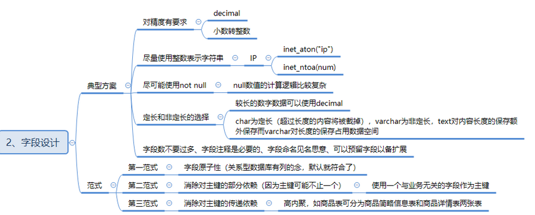

1. 字段合理设计
2. 字段类型，大小
3. 储存引擎
4. 索引设计
5. 分库分表
6. 主从复制
7. 备份
8. 试图，储存过程
9. 慢查询
10. 事务
11. 缓冲
12. 安全

数字- decimal28  double15  float 7

整数代替字符

datetime 8 timestamp 4

字符

不为空

定长

精简，可预留拓展字段

范式

1. 字段原子性
2. 消除对主键的部分依赖
3. 消除对主键的传递依赖

1. 避免使用 NULL，01 代替
2. 尽可能使用更小的字段

innodb 聚集索引 主键索引

有序的，有序查无绪遍历

极端 log2（N） 二分法效率

b+树 哈希索引区别

平衡的多叉树，节点间有指针相互连接是有序的

采用哈希算法，建值换哈希值，哈希算法无序（没有重复键，等值查询，不适合范围，排序，联合索引最左前缀规则）

记录少，数据重复50%，经常变更的表

表分区，逻辑上是还是一张表

1024个，外建

四种隔离级别

脏读：读已提交

幻读：读未提交

重复读：避免脏读，不可重复读

串行化：可避免脏，幻，重复读的发生。

1. 开启查询缓冲，优化查询
2. explan 查性能瓶颈
3. 使用limit
4. 为搜索建立索引
5. 使用枚举，字段取值有限固定
6. 储存过程，视图
7. 垂直分表
8. 选择合适的存储引擎